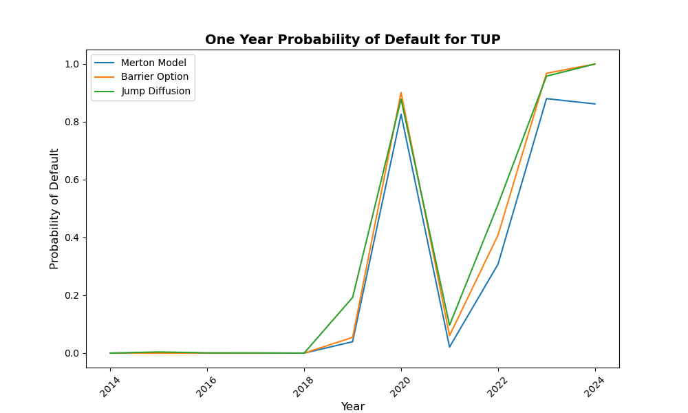
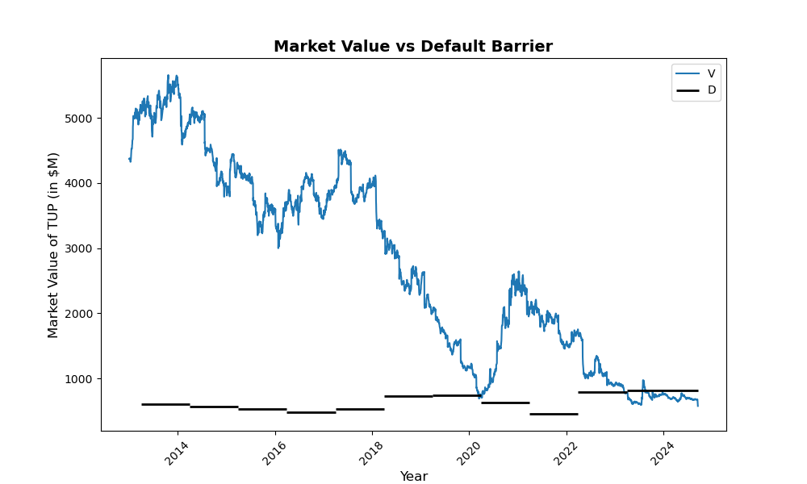
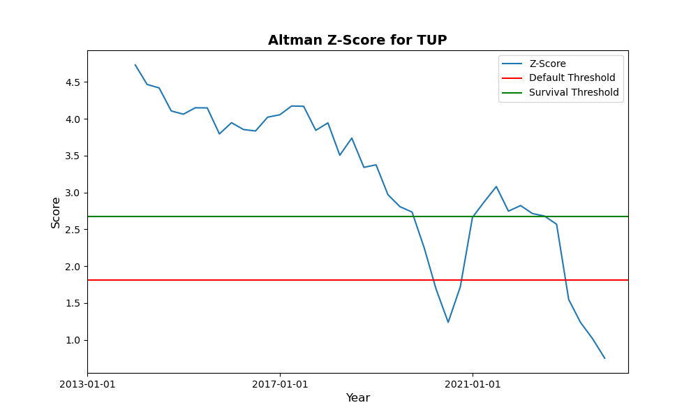
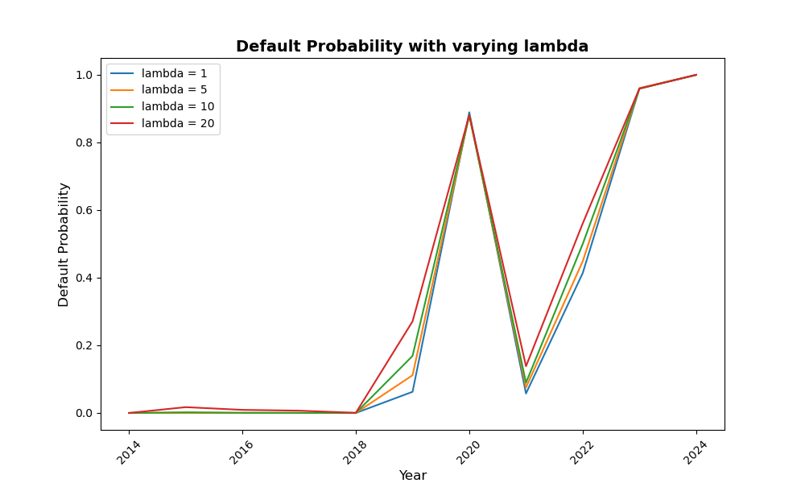
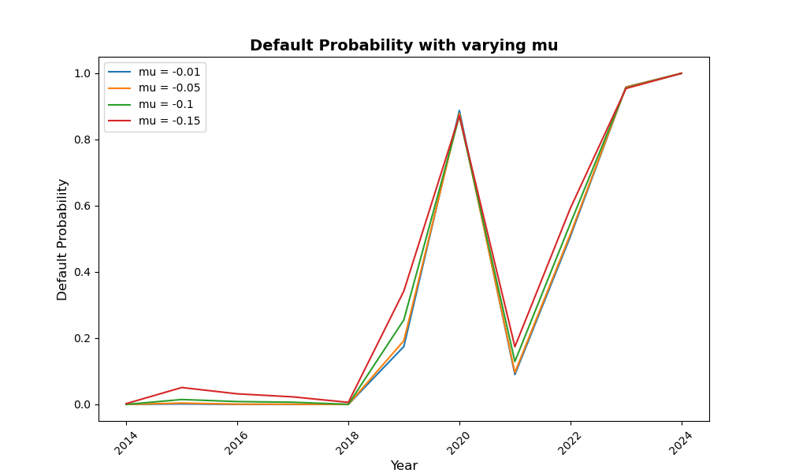

# Default Probability Models

This case study computes the one-year predicted default probabilities for Tupperware Brands (TUP) from 2013 through to its Chapter 11 filing in 2024. Four models are compared: Merton, Black and Cox, Merton jump diffusion, and the Altman Z-Score.

## Models

| Model | Type | Default occurs when |
|---|---|---|
| Merton (1974) | Structural | Asset value is below the default barrier at maturity |
| Black and Cox (1976) | Structural | Asset value touches the default barrier at any point |
| Merton jump diffusion (1976) | Structural | First passage, with jumps in the asset value |
| Altman Z-Score (1968) | Accounting | Score falls below 1.81 |


## Data

Daily prices, shares outstanding and returns from CRSP for 01-01-2013 to 16-09-2024. Quarterly debt and fundamentals from Compustat. Operating income and total liabilities from the 10-K and 10-Q filings on EDGAR. 10-year Treasury yields from FRED.

`scripts/generate_sample_data.py` builds synthetic data panels so the code runs without requiring CRSP/Compustat access. These panels exist solely to make the code run and do not reproduce the results and are based figures from the FY2013 and FY2022 10-Ks and interpolate data in between. 

## Results

### Structural models



All three models give a PD of essentially zero from 2014 to 2018, by which point revenue had already been falling for five years. The first real signal comes in 2019.

The PD jumps to 0.82-0.90 in 2020, when Tupperware had to undergo a debt restructuring of notes maturing in 2021. S&P rated the company SD (selective default) in July of that year. It then collapses to 0.02-0.10 in 2021 after successfully refinancing its debt. From 2022 the PD rises again as the next debt maturities approach, reaching 0.86-1.00 by 2024. Tupperware filed for Chapter 11 on September 17, 2024.

The Merton model produces lower PDs than the other two models in every year. It only allows for default at maturity, so it misses any path that hits the default barrier and recovers before then. The Black and Cox and the jump diffusion models allow default at any point and give consistently higher PDs.

### Market value against the default barrier



Asset value peaks at ~$5.7bn in 2013 and then gradually falls until it hits the default barrier in 2020. After the refinancing it briefly recovers before falling below the barrier in 2023 and staying below until its Chapter 11 filing. 

### Altman Z-Score



The Z-Score falls steadily from 4.7 in 2013 to around 2.7 by 2019, then drops to 1.25, recovers above 2.67 through 2021 and 2022, and falls to 0.75 by the end of the sample. The score reflects the spikes in PDs found by the structural models. 


### Sensitivity of the jump parameters





Varying the jump intensity from 1 to 20 and the mean jump size from -0.01 to -0.15 leaves the PD shape unchanged. The effect is concentrated in the transition years, reaching a spread of about 0.21 in 2019, and is negligible in years where the probability is already near 0 or near 1.

## Running the Code

```bash
pip install -r requirements.txt

# Runs synthetic data
python scripts/generate_sample_data.py
python scripts/run_analysis.py --sample

# with the licensed extracts placed in data/raw/
python scripts/run_analysis.py
```

## Files

```
src/creditrisk/
  merton.py			MertonModel: Black-Scholes call, KMV iteration, distance to default
  barrier.py          		BlackCoxBarrier: first passage probability
  jump_diffusion.py   		JumpDiffusion: Monte Carlo with a monitored barrier
  altman.py           		Altman: Z-Score
scripts/
  run_analysis.py           	runs all four models and produces the figures
  generate_sample_data.py   	synthetic data panels
```

## Notes

Tupperware filed no 10-Qs or 10-Ks after Q3 2023, so debt and fundamentals are only reported until then. Share prices run until the delisting in September 2024.

The jump diffusion uses 5,000 simulations. At a PD near 0.5 that is a standard error of roughly 0.7 percentage points.
